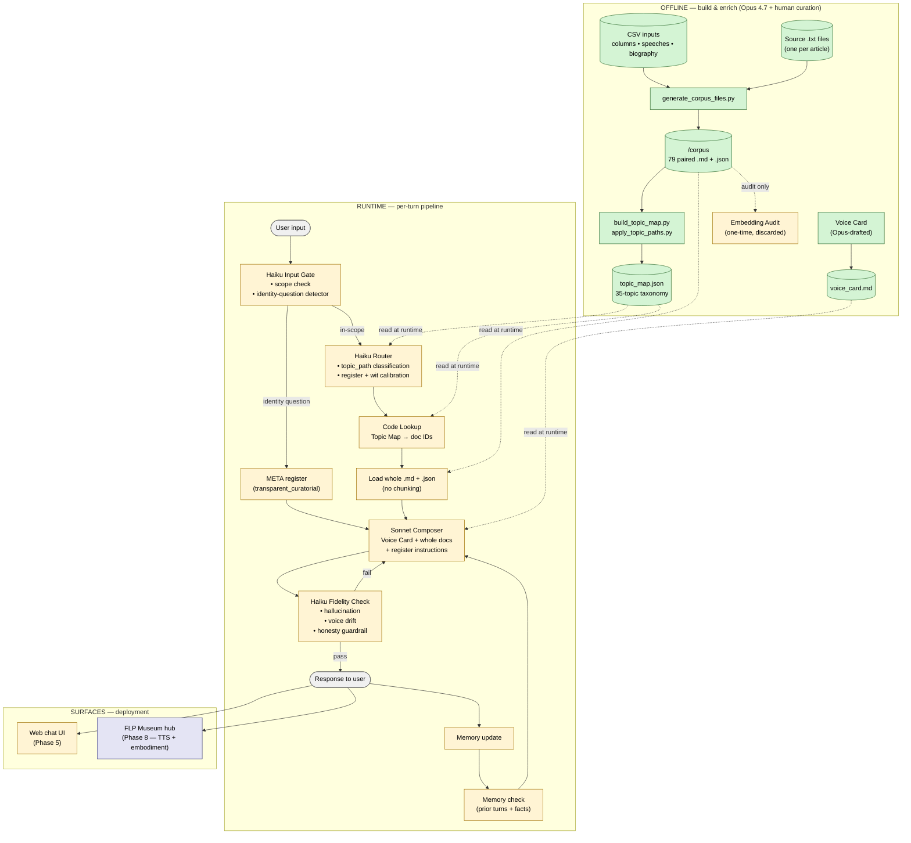
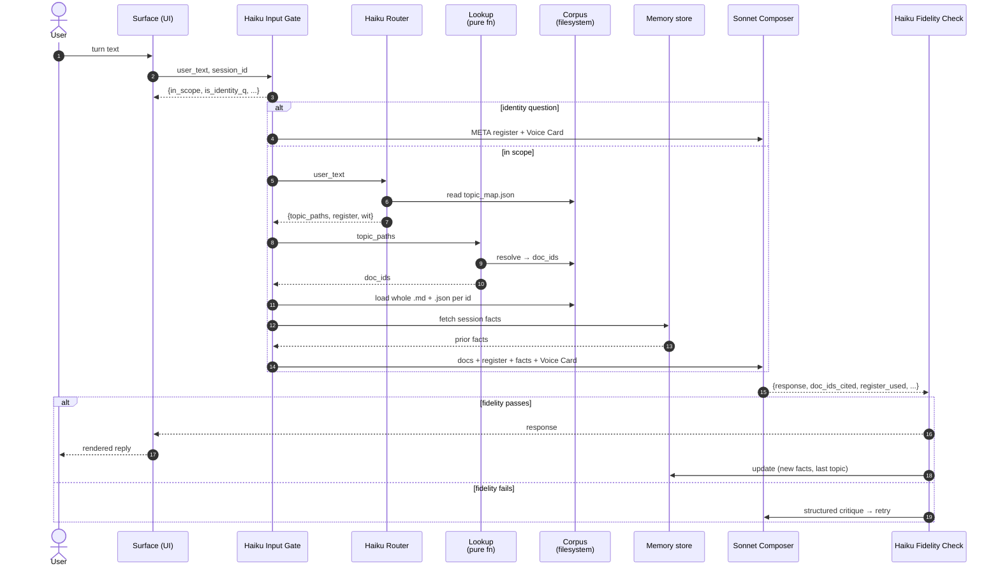
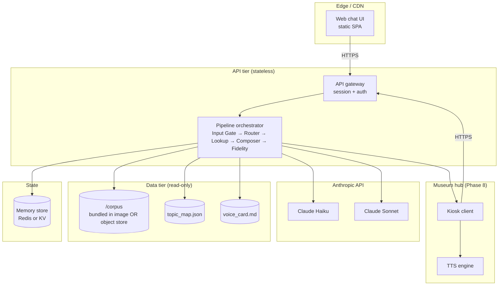

# CJ Panganiban Conversation App — Overall Architecture

**Version:** 1.0 (post-Phase-3)
**Status:** Phases 1–3 complete; Phase 4 (runtime) is the next build
**Audience:** FLP project team, engineers, future maintainers

This document gives a single, coherent picture of the whole system — the corpus that exists today, the runtime that is planned, and the deployment surfaces it must serve. It supersedes ad-hoc descriptions scattered across the project README.

---

## 1. Architectural principles

Five principles govern every decision below. They are not negotiable; the rest of the architecture is a faithful application of them.

**P1 — Curated structure beats statistical similarity.** The persona's strength is that CJP's actual 25-year corpus is small, dense, and high-signal. A hand-curated Topic Map → Document ID index outperforms any embedding-based retrieval. Embeddings are used only as an offline audit tool, never at runtime.

**P2 — Whole documents, not chunks.** Once a document is selected for a turn, it is sent to the composer in full. Chunking would shred CJP's signature openers, closers, and chiastic doublets — the exact features that make the voice his.

**P3 — Model stratification by capability needed.** Haiku for classification and verification (fast, cheap, deterministic-ish). Sonnet for composition (the only step where voice fidelity actually matters). Opus 4.7 offline only, for enrichment and persona synthesis.

**P4 — Honesty is structural, not stylistic.** The robot speaks first-person *as* CJP but never claims to *be* CJP. The Input Gate detects identity questions before composition begins and routes them through a dedicated META register. This is a pipeline property, not a prompt hope.

**P5 — Dates are first-class.** Every document carries an ISO date; runtime composition uses it to phrase temporal references correctly. No placeholder dates are ever introduced — undated source rows are deferred to a phase that can handle them properly.

---

## 2. The system at a glance

**Legend:** green = built (Phases 1–3) • amber = planned next (Phases 4–6) • blue = future (Phase 8).

---

## 3. Three layers

The architecture decomposes cleanly into three layers, each with a different change cadence.

### 3.1 Knowledge layer (slow — months)

The corpus itself. Curated CSVs → paired `.md` + `.json` files → Topic Map. Owned by editorial / human curators with Opus 4.7 as their drafting assistant. Lives in Git; every change is a reviewable commit.

| Artifact | Purpose | Cadence |
|---|---|---|
| `/corpus/**/*.md` | Canonical text per document, with YAML frontmatter | Edited on source change |
| `/corpus/**/*.json` | Structured retrieval index per document (entities, stances, signature phrases, register markers) | Edited on enrichment pass |
| `/corpus/voice/topic_map.json` | 35-topic taxonomy with matcher rules, per-doc `topic_paths` | Rebuilt by script when topics change |
| `/corpus/voice/voice_card.md` | Sonnet composer system prompt — identity, register table, honesty rule | Edited rarely, reviewed carefully |

### 3.2 Composition layer (fast — per turn)

The runtime pipeline. Stateless from turn to turn except for the Memory store. Reads the knowledge layer as a read-only resource — never writes to it.

The pipeline is six stages, each with a clear contract:

1. **Haiku Input Gate** — accepts user input; emits `{in_scope: bool, is_identity_question: bool, scope_violation_kind?: str}`. Identity questions bypass topic routing and go straight to META register.
2. **Haiku Router** — emits `{topic_paths: [...], register: str, wit_calibration: str, audience: [...]}`. Reads the Topic Map to resolve free-text topics into known paths.
3. **Code lookup** — pure function: `(topic_paths) → doc_ids`. No model call. Deterministic and cacheable.
4. **Load** — reads whole `.md` + `.json` from disk for each doc ID. No chunking, no summarization at load time.
5. **Sonnet Composer** — the only stage that writes prose. Inputs: Voice Card system prompt, whole docs, register instructions, memory facts. Outputs: draft response in first-person CJP voice.
6. **Haiku Fidelity Check** — three sub-checks: hallucination (claims not grounded in supplied docs), voice drift (register matches what the Router asked for), honesty guardrail (no claim of being the biological CJP). Failure routes back to the Composer with a structured critique.

### 3.3 Surface layer (variable — per deployment)

The chat UI, and eventually the FLP Museum hub with voice / embodiment. Surfaces are thin — they handle session, transport, and presentation. They do not touch the knowledge layer directly; they only call the composition layer.

Why this matters: the museum hub in Phase 8 will not need to re-implement anything in the composition layer. It plugs in at the surface boundary and adds TTS + display. Likewise, the web UI can be replaced wholesale without touching the persona.

---

## 4. Data contracts (the load-bearing interfaces)

The system holds together because four interfaces are stable and explicit. Treat these as the project's API contracts — change them only with a version bump.

### 4.1 Document JSON contract (knowledge → composition)

Every document JSON conforms to the schema in PROJECT.md §7. The fields the runtime depends on, in order of criticality:

| Field | Used by | Why it matters |
|---|---|---|
| `id` | All stages | Primary key for lookup and citation |
| `date`, `year` | Composer | Temporal phrasing (*"ten years ago I wrote..."*) |
| `topic_paths` | Router → Lookup | The whole retrieval mechanism |
| `routing.emotional_register` | Router | Register selection |
| `signature_phrases` | Composer | Voice fidelity |
| `stances[].would_repeat_today` | Composer, Fidelity Check | Prevents quoting outdated positions as current |
| `notable_anecdotes[].deployable_when` | Composer | Wit calibration — when an anecdote is on/off |
| `entities` | Fidelity Check | Hallucination detection — names that appear in the draft but not in any supplied doc trigger a re-write |

### 4.2 Topic Map contract (knowledge → router)

`topic_map.json` exposes:

- A flat list of topic nodes, each with: `path`, `matcher_rules` (keywords + phrase patterns), `default_register`, `default_wit`, `doc_ids[]`, `top_signature_phrases[]`.
- A theme-level defaults block — fallback register/wit when no specific topic fires.

The Router's only job is to map the user turn to one or more `topic_paths`. Lookup then resolves those paths to `doc_ids`.

### 4.3 Voice Card contract (knowledge → composer)

A single Markdown file passed as the Sonnet system prompt. Sections:

- **Identity** — who the speaker is, first-person rule
- **Honesty rule** — canonical META response
- **Voice fingerprint** — openers, closers, chiastic doublets, sentence rhythms
- **Doctrinal anchors** — twin beacons, rule of law vs. rule of force
- **Register selection table** — how to behave given the Router's register call
- **Context-block conventions** — how supplied docs are formatted in the prompt
- **Out-of-corpus reasoning policy** — what to say when the corpus is silent

### 4.4 Composer ↔ Fidelity Check contract

The Composer emits not just prose but a structured envelope: `{response: str, doc_ids_cited: [...], register_used: str, anecdotes_deployed: [...]}`. The Fidelity Check reads the envelope, not just the prose. This lets it verify *grounded-ness* (every claim → a doc ID) rather than re-reading the corpus from scratch each turn.

---

## 5. Per-turn flow, in detail

Notable properties:

- The Router never touches the corpus filesystem directly; it only reads `topic_map.json`. This keeps it light and lets the corpus be served from a separate volume in production if needed.
- Lookup is pure and cacheable. The same `topic_paths` always yields the same `doc_ids`.
- Memory is only written *after* the Fidelity Check passes — failed drafts never pollute the session state.
- A fidelity-failure retry loop has a hard cap (suggest: 2 retries). After cap, surface a graceful fallback ("Let me set that aside and approach it differently") rather than ship an unsafe response.

---

## 6. Memory layer

Memory is deliberately small. CJP's persona is not "remember everything the user has ever said" — it is "respond consistently within a conversation."

| Memory kind | Lifetime | Purpose |
|---|---|---|
| **Session turns** | Per session | Coherence across turns ("you mentioned earlier...") |
| **Session facts** | Per session | Lightweight key-value extracted from turns (user's name, topic of interest) |
| **Identity-question count** | Per session | Avoid repeating the full honesty disclosure verbatim every turn — vary phrasing on Nth ask |
| **Topic recency** | Per session | Avoid redeploying the same anecdote twice in close succession |

No cross-session memory in v1. If/when added, it must be opt-in and scoped.

---

## 7. Deployment topology

Notes on scale:

- The corpus is small (few hundred docs, total ~MB scale). Bundling it into the API image is simplest and fastest; object storage is only worth it if multiple regions diverge.
- The orchestrator is stateless — horizontal scale is trivial. Memory is the only stateful component and a small Redis is overkill but standard.
- Per-turn latency budget: Input Gate + Router + Lookup + Load ≈ 1 Haiku call + filesystem reads ≈ 1–2s. Composer = 1 Sonnet call ≈ 3–6s. Fidelity = 1 Haiku call ≈ 1–2s. Total target: under 10s p95.

---

## 8. Failure modes & guardrails

| Failure | Detection | Response |
|---|---|---|
| User asks something out of CJP's corpus | Input Gate scope check; Router returns no topic match | Composer falls back to the *"I haven't addressed that in my writings, but on the related question of X..."* template |
| User tries to extract a claim CJP wouldn't endorse today | `stances[].would_repeat_today == false` flag on retrieved doc | Composer adds temporal hedge; Fidelity verifies it's present |
| Sonnet hallucinates a name not in supplied docs | Fidelity Check entity diff (draft entities − supplied entities) | Re-prompt Composer with explicit "do not introduce X" |
| Sonnet drifts into third person about CJP | Fidelity grammatical check on subject pronouns | Re-prompt |
| User asks "are you real?" | Input Gate `is_identity_question` true | META register; canonical honesty phrasing |
| Topic Map returns too many docs (>5) | Lookup count | Router re-narrows with a sharper topic_path; or take top-N by recency + theme match |
| Topic Map returns zero docs but turn is in-scope | Lookup empty result | Theme-level fallback docs (Voice Card section 8 — out-of-corpus reasoning policy) |
| Fidelity Check itself fails repeatedly | Retry counter | Surface graceful deflection, log incident, do not ship |

---

## 9. What changes between phases

| Phase | New components | Risk |
|---|---|---|
| 1–3 (done) | Corpus, Topic Map, Voice Card | Editorial — owned by curators |
| 4 (next) | Orchestrator, Haiku Gate/Router/Fidelity, Sonnet Composer, Memory | Latency, fidelity-pass rate, register correctness |
| 5 | Web chat UI | Standard frontend risk |
| 6 | One-time embedding audit | None at runtime — offline only |
| 7 | Biography (`GC001`) + book corpus addition | Re-run Topic Map; verify date-handling for the biography |
| 8 | TTS + Museum hub | Voice cloning ethics, kiosk hardening, accessibility |

The architecture is designed so that **Phase 4 is the only risky build**. Phases 5–8 are additive at the surface boundary.

---

## 10. Open questions for Phase 4 kickoff

These should be resolved before code is written, not during:

1. **Where does the corpus live in production?** Bundled in the orchestrator image (simplest) vs. object storage (more flexible). Recommend bundled until corpus exceeds ~50 MB.
2. **What is the Fidelity Check's exact contract for hallucinated quotes?** Specifically, when Sonnet uses a paraphrase that *resembles* a signature phrase but isn't verbatim — pass or fail? Recommend: pass if the paraphrase is faithful in substance and the resemblance to a signature phrase is incidental.
3. **Memory store choice.** Redis is overkill for v1; an in-process LRU per orchestrator instance is simpler but loses on horizontal scale. Recommend: start in-process, migrate to Redis when a second instance is needed.
4. **Retry budget on Fidelity failure.** 2 retries balances cost vs. quality. Worth A/B testing.
5. **Logging granularity.** Every turn produces: input gate output, router output, doc IDs loaded, fidelity verdict, final response. Recommend: structured logs to a separate sink; do not log raw user PII.

---

*Maraming salamat po.*
